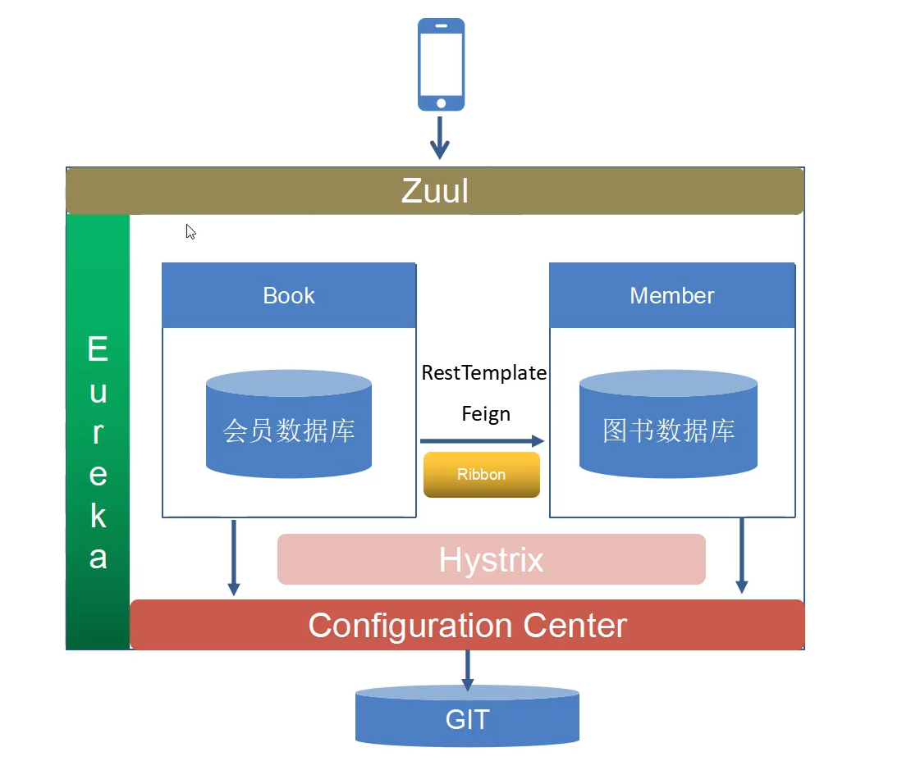

# SpringCloud

[SpringCloud上](/note/pre/SpringCloud.md)

[SpringCloud下](/note/next/SpringCloud2.md)

## 分布式架构

## Eureka注册中心-Server

```xml
<parent>
        <groupId>org.springframework.boot</groupId>
        <artifactId>spring-boot-starter-parent</artifactId>
        <version>2.0.1.RELEASE</version>
        <relativePath/> <!-- lookup parent from repository -->
    </parent>
    <groupId>com.ntuzy.springcloud</groupId>
    <artifactId>registry</artifactId>
    <version>0.0.1-SNAPSHOT</version>
    <name>registry</name>
    <description>Demo project for Spring Boot</description>

    <properties>
        <java.version>1.8</java.version>
        <spring-cloud.version>Finchley.RC1</spring-cloud.version>
</properties>
```

```properties
spring:
  application:
    # 注册中心名称
    name: registry

# 注册中心映射端口号 建议默认与Eureka一致
server:
  port: 8761

```

```java
package com.ntuzy.springcloud.registry;

import org.springframework.boot.SpringApplication;
import org.springframework.boot.autoconfigure.SpringBootApplication;
import org.springframework.cloud.netflix.eureka.server.EnableEurekaServer;

@SpringBootApplication
@EnableEurekaServer  //启动注册中心
public class RegistryApplication {

    public static void main(String[] args) {
        SpringApplication.run(RegistryApplication.class, args);
    }

}

```

## Eureka-Client

```xml
<parent>
        <groupId>org.springframework.boot</groupId>
        <artifactId>spring-boot-starter-parent</artifactId>
        <version>2.0.1.RELEASE</version>
        <relativePath/> <!-- lookup parent from repository -->
    </parent>
    <groupId>com.ntuzy.springcloud</groupId>
    <artifactId>registry</artifactId>
    <version>0.0.1-SNAPSHOT</version>
    <name>registry</name>
    <description>Demo project for Spring Boot</description>

    <properties>
        <java.version>1.8</java.version>
        <spring-cloud.version>Finchley.RC1</spring-cloud.version>
</properties>
```

```properties
spring:
  application:
    name: client
eureka:
  client:
    service-url:
      defaultZone : http://localhost:8761/eureka/

```

+ app

  ```java
  @SpringBootApplication
  @EnableEurekaClient // 在启动 Eureka Server 注册 客户端
  public class ClientApplication {
  
      public static void main(String[] args) {
          SpringApplication.run(ClientApplication.class, args);
      }
  
  }
  ```

## 网关Netflix Zuul  

+ Gateway 网关

  以轮询的方式访问系统中的所有客户端

  > // Zuul 路由的访问规则是// http://xxxx:xxx/service-id

  client + Zuul

  ```xml
   <dependency>
              <groupId>org.springframework.cloud</groupId>
              <artifactId>spring-cloud-starter-netflix-eureka-client</artifactId>
          </dependency>
          <dependency>
              <groupId>org.springframework.cloud</groupId>
              <artifactId>spring-cloud-starter-netflix-zuul</artifactId>
          </dependency>
  ```

+ application.yml

  ```properties
  spring:
    application:
      name: gateway
  eureka:
    client:
      service-url:
        defaultzone: http://localhost:8761/eureka/
  
  server:
    port: 9000
  ```

+ app

  ```java
  @SpringBootApplication
  @EnableDiscoveryClient
  @EnableZuulProxy   // 启动Zuul路由服务
  // Zuul 路由的访问规则是
  // http://xxxx:xxx/service-id
  public class GatewayApplication {
  
      public static void main(String[] args) {
          SpringApplication.run(GatewayApplication.class, args);
      }
  
  }
  ```

### 自定义规则

>  http://localhost:9000/c/msg

+ application.yml

  ```properties
  zuul:
    routes:
      client: /c/**
  ```

## Eureka 注册中心 高可用配置

+ application.yml

  ```properties
  spring:
    application:
      # 注册中心名称
      name: registry
  
  # 注册中心映射端口号 建议默认与Euraka一致
  server:
    port: 8761
  # 对应Euraka没必要注册客户端
  eureka:
    client:
      register-with-eureka: false
      service-url:
        defaultZone: http://localhost:8762/eureka
  
  ```

## 实战

### member

eureka client + web + jpa + jdbc

+ application.xml

  ```xml
  spring:
    application:
      name: member
    datasource:
      username: root
      password: 123456
      driver-class-name: com.mysql.jdbc.Driver
      url: jdbc:mysql://localhost:3306/sc-member?useUnicode=true&characterEncoding=UTF-8&serverTimezone=UTC
  
  server:
    port: 8000
  eureka:
    client:
      service-url:
        defaultZone: http://localhost:8761/eureka
  
  ```

## 配置中心

client+config server+ config client

> http://localhost:9100/[clientid]-profiles.yml|xml|properties

+ application.yml

  ```properties
  spring:
    application:
      name: config
    cloud:
      config:
        server:
          git:
            uri: https://gitee.com/ntuzy/sc-config
            username: 562018301@qq.com
            password: *********
  server:
   port: 9100
  ```

+ application

  ```java
  package com.ntuzy.springcloud.config;
  
  import org.springframework.boot.SpringApplication;
  import org.springframework.boot.autoconfigure.SpringBootApplication;
  import org.springframework.cloud.client.discovery.EnableDiscoveryClient;
  import org.springframework.cloud.config.server.EnableConfigServer;
  
  @SpringBootApplication
  @EnableDiscoveryClient
  @EnableConfigServer
  public class ConfigApplication {
  
      public static void main(String[] args) {
          SpringApplication.run(ConfigApplication.class, args);
      }
  
  }
  ```

+ member 中删除application.yml 增加 bootstrap.yml

  ```properties
  spring:
    application:
      name: book
    cloud:
      config:
        discovery:
          enabled: true
          service-id: config
        profile: dev
  eureka:
    client:
      service-url:
        defaultZone: http://localhost:8761/eureka
  
  ```

## 微服务之间的通信RestTemplate_Ribbon

+ 方案一

  ```java
  @GetMapping("/test")
  @ResponseBody
  public String test(Long bid) {
      // 最简单的情况就是使用内置Spring Cloud 内置的RestTemplate
      // RestTemplate 底层http传输就是apache HttpClient 组件
      RestTemplate restTemplate = new RestTemplate();
      String json = restTemplate.getForObject("http://localhost:8100/info?bid=" + bid, String.class);
      System.out.println(json);
      return json;
  }
  ```

+ 方案二-轮询

  ```java
  // 负载均衡客户端 Ribbon核心组件
  @Resource
  private LoadBalancerClient loadBalancerClient;
  
  @GetMapping("/test")
  @ResponseBody
  public String test(Long bid) {
      // 最简单的情况就是使用内置Spring Cloud 内置的RestTemplate
      // RestTemplate 底层http传输就是apache HttpClient 组件
      //        RestTemplate restTemplate = new RestTemplate();
      //        String json = restTemplate.getForObject("http://localhost:8100/info?bid=" + bid, String.class);
      //        System.out.println(json);
      //        return json;
  
      // Ribbon
      RestTemplate restTemplate = new RestTemplate();
      ServiceInstance instance = loadBalancerClient.choose("book");
      String host = instance.getHost(); // 获取主机名
      int port = instance.getPort();  // 获取端口号
      String json = restTemplate.getForObject("http://"+ host +":"+ port +"/info?bid=" + bid, String.class);
      return json;
  }
  ```

+ 方法三 注解

  ```java
  package com.ntuzy.springcloud.member;
  
  import org.springframework.boot.SpringApplication;
  import org.springframework.boot.autoconfigure.SpringBootApplication;
  import org.springframework.cloud.client.loadbalancer.LoadBalanced;
  import org.springframework.context.annotation.Bean;
  import org.springframework.web.bind.annotation.CrossOrigin;
  import org.springframework.web.client.RestTemplate;
  
  @SpringBootApplication
  public class MemberApplication {
  
      @Bean
      @LoadBalanced // 对 restTemplate 对象进行负载均衡
      public RestTemplate restTemplate(){
          return new RestTemplate();
      }
  
      public static void main(String[] args) {
          SpringApplication.run(MemberApplication.class, args);
      }
  
  }
  
  ```

  controller

  ```java
  @Resource
  private RestTemplate restTemplate;
  
  @GetMapping("/test")
  @ResponseBody
  public String test(Long bid) {
      // 利用注解简化url通信
      String json = restTemplate.getForObject("http://book/info?bid=" + bid, String.class);
      return json;
  }
  ```

## 服务间通信-Feign

默认支持负载均衡 同Ribbon

```xml
<!-- Feign -->
<dependency>
    <groupId>org.springframework.cloud</groupId>
    <artifactId>spring-cloud-starter-openfeign</artifactId>
</dependency>
```

+ application

  ```java
  @SpringBootApplication
  @EnableDiscoveryClient
  @EnableFeignClients
  public class MemberApplication {
  
      @Bean
      @LoadBalanced // 对 restTemplate 对象进行负载均衡
      public RestTemplate restTemplate(){
          return new RestTemplate();
      }
  
      public static void main(String[] args) {
          SpringApplication.run(MemberApplication.class, args);
      }
  
  }
  ```

+ BookClinet

  ```java
  package com.ntuzy.springcloud.member.client;
  
  import org.springframework.cloud.openfeign.FeignClient;
  import org.springframework.web.bind.annotation.GetMapping;
  import org.springframework.web.bind.annotation.RequestParam;
  
  @FeignClient(name = "book")  // 指明这是book微服务的调用客户端
  public interface BookClient {
      @GetMapping("/info") // 当调用getInfo方法的时候 自动向book微服务book的info发起请求
      // 会将bid=xxx 附加到info中
      public String getInfo(@RequestParam("bid") Long bid);
      
       // Get请求对应getmapping Post请求postMapping
      // Post请求传递参数的时候使用@requestBody
      @PostMapping("/create")
      public String create(@RequestBody Map rec);
      
  }
  ```

+ BookController

  ```java
  @Resource
  private BookClient bookClient;
  
  @GetMapping("/test1")
  @ResponseBody
  public String test1(Long bid) {
      String json = bookClient.getInfo(bid);
      return json;
  }
  ```

### 将传入结果反序列化

+ memberDTO

  将其他系统的entity转换到此系统中

  ```java
  package com.ntuzy.springcloud.book.client;
  
  import java.util.Date;
  
  public class MemberDTO {
  
      private Long mid;
      private String name;
      private String idno;
      private String mobile;
      private Date regdate;
      private Date expdate;
  
  
      public Long getMid() {
          return mid;
      }
  
      public void setMid(Long mid) {
          this.mid = mid;
      }
  
      public String getName() {
          return name;
      }
  
      public void setName(String name) {
          this.name = name;
      }
  
      public String getIdno() {
          return idno;
      }
  
      public void setIdno(String idno) {
          this.idno = idno;
      }
  
      public String getMobile() {
          return mobile;
      }
  
      public void setMobile(String mobile) {
          this.mobile = mobile;
      }
  
      public Date getRegdate() {
          return regdate;
      }
  
      public void setRegdate(Date regdate) {
          this.regdate = regdate;
      }
  
      public Date getExpdate() {
          return expdate;
      }
  
      public void setExpdate(Date expdate) {
          this.expdate = expdate;
      }
  }
  
  ```

+ MemberResult

  ```java
  package com.ntuzy.springcloud.book.client;
  
  public class MemberResult {
  
      private String code;
      private String message;
      private MemberDTO data;
  
      public String getCode() {
          return code;
      }
  
      public void setCode(String code) {
          this.code = code;
      }
  
      public String getMessage() {
          return message;
      }
  
      public void setMessage(String message) {
          this.message = message;
      }
  
      public MemberDTO getData() {
          return data;
      }
  
      public void setData(MemberDTO data) {
          this.data = data;
      }
  }
  ```

## 容错机制

### Eureka Hystrix 服务降级

```xml
<!-- hystrix -->
<dependency>
    <groupId>org.springframework.cloud</groupId>
    <artifactId>spring-cloud-starter-netflix-hystrix</artifactId>
</dependency>
```

+ controller

  ```java
  @GetMapping("/test")
  @ResponseBody
  @HystrixCommand(fallbackMethod = "fallback")
  public String test(Long bid) {
      // 利用注解简化url通信
      String json = restTemplate.getForObject("http://book/info?bid=" + bid, String.class);
      return json;
  }
  
  // 服务降级的方法 要求返回值参数与目标方法保持一致
  private String fallback(Long bid) {
      return "当前系统正忙,请稍后再试";
  }
  ```

+ application

  ```java
  @SpringBootApplication
  @EnableDiscoveryClient
  @EnableFeignClients
  @EnableCircuitBreaker  // 断路器
  public class MemberApplication {
  
      @Bean
      @LoadBalanced // 对 restTemplate 对象进行负载均衡
      public RestTemplate restTemplate() {
          return new RestTemplate();
      }
  
      public static void main(String[] args) {
          SpringApplication.run(MemberApplication.class, args);
      }
  
  }
  ```

#### 全局降级

+ controller

  ```java
  @DefaultProperties(defaultFallback = "defaultFallBack")
  public class MemberController {
      // 全局默认的降级方法 不需要参数 且返回String或者任何可以被Json序列化的对象
      private String defaultFallBack(){
          return "当前系统正忙,请稍后再试111";
      }
  }
  ```

### Feign+Hystrix 服务降级

+ MemberClient

  ```java
  package com.ntuzy.springcloud.book.client;
  
  import org.springframework.cloud.openfeign.FeignClient;
  import org.springframework.stereotype.Component;
  import org.springframework.web.bind.annotation.GetMapping;
  import org.springframework.web.bind.annotation.RequestParam;
  
  @FeignClient(name = "member", fallback = MemberClient.MemberClientFallBack.class)
  public interface MemberClient {
  
      @GetMapping("/check")
      public MemberResult checkMobile(@RequestParam("mobile") Long mobile);
  
      @Component
      static class MemberClientFallBack implements MemberClient {
  
          @Override
          public MemberResult checkMobile(Long mobile) {
              MemberResult mr = new MemberResult();
              mr.setCode("0");
              mr.setMessage("success");
              return mr;
          }
      }
  
  }
  ```

+ application.yml

  ```properties
  # 启动feign+Hystrix
  feign:
    hystrix:
      enabled: true
  ```

## Hystrix 断路器

统计过往请求多少成功多少失败 失败请求过多就会断开。哪怕正确的请求都会自动降级，过一段时间再尝试发送请求。断路器变成半开的时候，访问请求成功，断路器关闭，访问正常。否则访问失败，再等一段时间再次请求，

+ application.yml

  ```properties
  hystrix:
    command:
      default:
        execution:
          isolation:
            thread:
              timeoutInMilliseconds: 3000
        circuitBreaker:
          requestVolumeThreshold: 10
          sleepWindowInMilliseconds: 10000
          errorThresholdPercentage: 60
  ```

  


